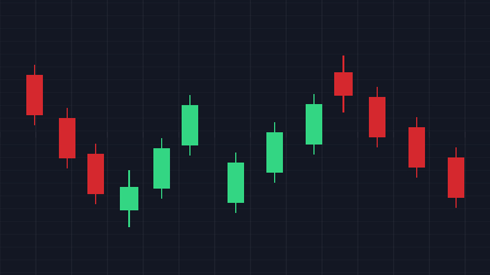

# Web Scraping & Analysis of Forex Data 

## Dataset

> When trading forex, most traders rely on the backtesting and the statistics of trade strategies. For this purpose, historical trading data is analyzed to predict possible movements in the market. In this project, we will analyze historical forex data from [myfxBook](https://www.myfxbook.com), a popular platform used by forex traders to connect and perform trade analysis. The project is in two parts; web scraping and analysis. Using selenium, we scraped historical data between January 2nd 2019 and September 30th 2022 for all the major currency pairs and a few cross currency pairs, and stored the scraped  data for each currency pair in a csv file. Our analysis will focus on the OHLC prices for these currency pairs, with the goal of detecting the movements and trends in the market for the highlighted period.
The currency pairs include: `AUDJPY` `AUDUSD` `EURJPY` `EURUSD` `GBPUSD` `NZDUSD` `USDCAD` `USDCHF` `USDJPY` `XAUUSD`

The following is a dictionary of column headers in the dataframes -

     Date - the day of reference. Each row represents one day.
     High - the highest price of the pair on the reference day.
     Low - the lowest price of the pair on the reference day.
     Open - the opening price of the pair on the reference day.
     Close - the closing price of the pair on the reference day.
     Change (Pips) - the difference in pips between the previous day and reference day.

After gathering the data, I carried out preliminary data wrangling and concatenated the dataframes into one dataframe, resulting in 9,725 entries. Subsequently, I carried out exploratory analysis including plotly candlestick charts, and then stored the clean data in a csv file.

## Conclusions

From the analysis -

- Gold peaked close to 2100 around August 2020 and currently appears to be in a bearish trend. Gold however is highly volatile and should be traded with multiple effective trading strategies, whether scalping or trading long term.
- Moving averages presented smoother price action that gave a clearer picture of the market trend, but considering that it is a lagging indicator, it's probably best not to use it as a sole technical indicator to predict future trends. We see a cross of the moving averages preceding the bullish run of the US dollars to it's highest point around March 2020.
- The candlestick charts gave better and easy-to-interprete visuals of the market sentiment, and from observing the candlestick patterns, we see that the US dollars is currently growing on other major currency pairs. While this might nudge traders to go long on the dollar, it should be verified by analyzing with other technical indicators.

Screenshots of some candlestick charts were added to the notebook for an overview on GitHub, but to view all the interactive candlestick charts, copy the iPython [notebook url](https://github.com/owhonda-moses/Forex_Web_Scraping_and_Analysis/blob/master/forex_analysis.ipynb) and paste it in <u>[Jupyter Notebook Viewer](https://nbviewer.org/)</u>.

>>_PS: I selected a dark background for the viz because I use a dark theme in my Jupyter notebook._

#### PACKAGES USED:

- Selenium
- NumPy
- Pandas
- Plotly
- Matplotlib
- Seaborn

_References for this repo include:_
- https://datarade.ai/
- https://www.babypips.com
- https://eatradingacademy.com
- https://stackoverflow.com/
- https://selenium-python.readthedocs.io/

**THIS PROJECT IS <u>NOT</u> INTENDED TO BE A RECOMMENDATION TO TRADE ANY OF THE CURRENCY PAIRS BASED ON THIS TRADE ANALYSIS.**

_For various reasons, one of which is trader manipulation, stats used in this analysis might differ from current stats, as well as trading stats from other brokers or forex trading platforms._
